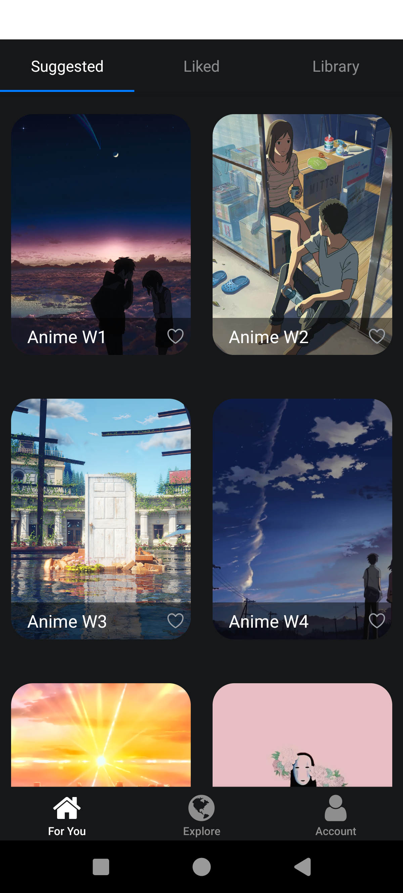

<div align="center">
<h1>Cross Platform Wallpaper App</h1>
</div>

This is a mobile app where users can find a likable wallpaper and download it to use as their phone's wallpapers. Since it uses react native, it can run on both android and ios.

<div align="center">
  <a href="./end-app/screen-20250105-205203.mp4">
    
  </a>
</div>

## Table of Contents

- [Installation](#installation)
- [Usage](#usage)
- [Codebase Structure](#codebase-structure)
- [Contributing](#contributing)
- [License](#license)

## Installation

1. **Clone the repository:**

    ```sh
    git clone https://github.com/bhivgadearav/panels-clone.git
    cd panels-clone
    ```

2. **Install dependencies:**

    ```sh
    npm install
    ```

3. **Start the project:**

    For Android:
    ```sh
    npm run android
    ```

    For iOS:
    ```sh
    npm run ios
    ```

    For Web:
    ```sh
    npm run web
    ```

    For other options:
    ```sh
    npm start
    ```

## Usage

To run the application locally, follow the installation steps above. You can use the commands to start the project on your preferred platform (Android, iOS, or Web).

## Codebase Structure

- **app**: Contains the main application components and screens. This folder often includes navigators, context providers, and other high-level components.
- **assets**: Stores static assets like images, fonts, and other media files used in the application.
- **components**: Includes reusable UI components that can be used across different parts of the application to maintain consistency and modularity.
- **constants**: Contains constant values and configuration settings such as theme colors, API endpoints, or other static data.
- **hooks**: Stores custom React hooks that encapsulate reusable logic which can be shared across different components.
- **scripts**: Includes utility scripts for various tasks like project setup, maintenance, or automation.
- **end-app**: Includes a video and images of the application while running.

## Dependencies

The project relies on several dependencies, including but not limited to:

- `@expo/vector-icons`
- `@react-navigation/native`
- `expo`
- `react`
- `react-native`
- `expo-router`

## Contributing

Contributions are welcome! Feel free to open issues or submit pull requests.

## License

This project is licensed under the MIT License.
